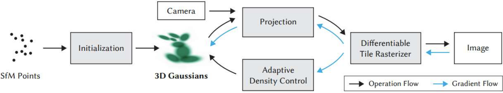
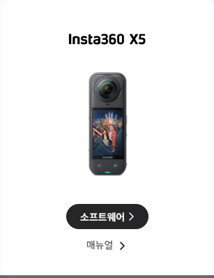
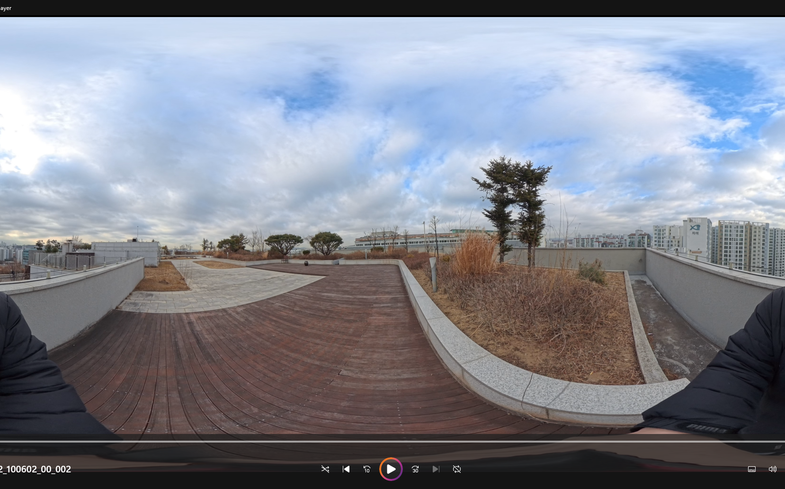
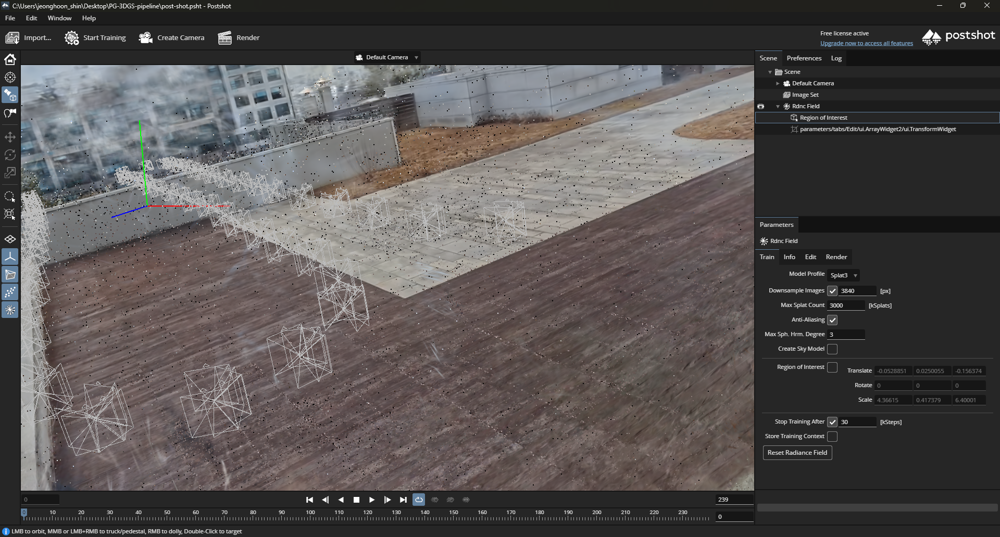

# Gaussian Splatting: From Capture to Reconstruction

  
   
  <em>Figure 0: An overview of the Gaussian Splatting workflow, illustrating the process from SfM points to final image generation.</em>

## Abstract
*   **Objective:** Document the methodology for 3D scene reconstruction using Gaussian Splatting.
*   **Process:**
    *   Data Acquisition (360° Camera)
    *   Image Preprocessing
    *   Structure from Motion (SfM)
    *   Gaussian Point Cloud Optimization
*   **Content:** Details tools, parameters, and system specifications.
*   **Key Finding:** Processing limitations were identified and addressed.

## Introduction
*   **Purpose:** Document the end-to-end workflow for a Gaussian Splatting 3D scene reconstruction.
*   **Scope:** From initial video capture to the final optimized Gaussian point cloud.
*   **Focus:** Procedural account of tools, configurations, and key decisions.

## System Specifications
| Component | Specification |
| :---------- | :------------------------------------------- |
| CPU | 13th Gen Intel(R) Core(TM) i7-13620H @ 2.40 GHz |
| RAM | 32.0 GB |
| GPU | NVIDIA GeForce RTX 4060 Laptop GPU |
| VRAM | 8.0 GB (Dedicated) |

## Methodology: Data Acquisition
*   **Hardware:** Insta360 X5 Camera

  
   
  <em>Figure 1: The Insta360 X5 camera used for data acquisition.</em>

*   **Mode:** Equirectular 360° Video

  
   
  <em>Figure 2: An equirectangular frame captured from the 360° video footage.</em>

*   **Initial Processing:** [Insta360 Editor](https://www.insta360.com/kr/download)
    *   **Export Format:** 360 Video (MP4)
    *   **Stabilization:**
        *   Direction Lock enabled.
        *   Ensures consistent orientation.

  
   
  <em>Figure 3: Insta360 Editor export settings, highlighting '360 Video' format and 'Direction Lock' stabilization.</em>

*   **Data Capture Note:**
    *   Single camera utilized due to hardware limitations.
    *   Differs from multi-camera recommendations for optimal results.

## Recommendations: Data Acquisition
*   **Lighting:**
    *   Natural sunlight preferred.
    *   Outperforms artificial indoor lighting, even if cloudy.
*   **Lens:** Use a lens with minimal distortion effects.
*   **Capture Method:**
    *   Prioritize still photographs to avoid motion blur.
    *   If using video, ensure smooth and gentle camera movement.
*   **Shooting Strategy:**
    *   Initial focus: Object-centric captures (tends to yield better results).
    *   Subsequent focus: Progress to background/indoor scenes after initial validation.
*   **Captures** Maximize overlap between frames, but minimize overlap between cameras within the same frame.

## Methodology: Image Preprocessing
*   **Software:** [Blender with 360 Extractor addon](https://toppinappi.gumroad.com/l/360extractor).

  
   
  <em>Figure 4: The Blender interface with the 360 Extractor addon, showing virtual camera setup and output settings. For detailed usage, refer to the addon's usage guide in the References section.</em>

*   **Process:**
    *   Virtual camera extracts cropped views.
    *   Source: From 360° video.
*   **Configuration:**
    *   **Output Resolution:** 1920x1920 pixels
    *   **Aspect Ratio:** 1:1

## Concepts: [COLMAP](https://colmap.github.io/) (Sensors, Rigs, Frames)
*   **[COLMAP](https://colmap.github.io/) 3.12:** Enhanced support for specific camera configurations:
    *   **Sensors:** Representation of individual camera sensors.
    *   **Rigs:** Grouping of multiple cameras with fixed relative poses (e.g., a multi-camera setup or a 360 camera with multiple virtual views).
    *   **Frames:** Sequential captures from a rig, maintaining consistent relative sensor poses.
*   **Relevance:** Critical for multi-sensor platforms and 360° panorama images.

## Methodology: Structure from Motion (SfM)
*   **Software:** [COLMAP](https://colmap.github.io/) (Open-source SfM pipeline).

  
   
  <em>Figure 5: COLMAP GUI showing the sparse reconstruction and estimated camera poses.</em>

*   **Input:** Preprocessed 1920x1920 images.
*   **Performance Note:**
    *   Using CUDA is highly recommended.
    *   Dramatically reduces processing time, even though SfM can run on CPU alone.
*   **Key Operations:**
    *   Feature identification and matching.
    *   Camera pose estimation (intrinsic/extrinsic parameters).
    *   Sparse 3D point cloud reconstruction.
*   **Output:**
    *   Camera parameters.
    *   Sparse point cloud (input for next stage).

## Methodology: Gaussian Splatting Generation
*   **Software:** [PostShot](https://www.jawset.com/).

  
   
  <em>Figure 6: Uninstalling the following plugins may make it un-compatible with colmap data.</em>

*   **Input:** [COLMAP](https://colmap.github.io/) project data (camera poses & sparse point cloud).
*   **Process:**
    *   Optimization of Gaussian primitives for scene representation.
    *   Iterative refinement of:
        *   Position, color, opacity, covariance.
        *   Method: Gradient descent.
*   **Output:**
    *   High-fidelity, renderable.
    *   Optimized Gaussian point cloud.

## Results and Discussion
*   **Processing Challenge ([COLMAP](https://colmap.github.io/)):**
    *   **Initial Attempts (~1000 images):**
        *   Windows: Instability (panicked).
        *   Ubuntu: Prohibitive processing times.
    *   **Solution:**
        *   Image set reduced to ~300 frames.
        *   Enabled successful processing.
        *   **Context:**
            *   Corresponds to 30 seconds of footage.
            *   (5 virtual cameras @ 2 fps).
## Conclusion
*   **Outcome:**
    *   3D scene reconstructed as optimized Gaussian point cloud.
    *   Source: Single 360° video.
*   **Workflow:**
    *   Specialized pipeline utilized.
    *   Tools: [Insta360 Editor](https://www.insta360.com/kr/download), Blender, [COLMAP](https://colmap.github.io/), [PostShot](https://www.jawset.com/).
*   **Key Finding:**
    *   Input image quantity must be balanced with hardware capabilities.
    *   Context: SfM stage.
*   **Viability:**
    *   Viable method for generating Gaussian point clouds.
    *   Context: Consumer-grade hardware.

    

  
   
  <em>Figure 7: PostShot GUI showing the imported COLMAP data and the initial setup for Gaussian Splatting generation.</em>

## Future Work: Workflow Improvements
*   **Optimize [COLMAP](https://colmap.github.io/) Parameterization for Enhanced Accuracy (using Sensors, Rigs, and Frames):**
    *   **Hypothesis:** Explicit parameterization of COLMAP's 'Sensors', 'Rigs', 'Frames' (leveraging known rig info) will improve accuracy and efficiency.
    *   **Action:**
        1.  **Baseline Generation:** Reconstruction without manual parameterization.
        2.  **Parameterized Generation:**
            *   Reconstruction with manual configuration of 'Sensors', 'Rigs', 'Frames'.
            *   Tailored to fixed virtual camera positions from 360 Extractor.
        3.  **Comparative Rendering:** Render from both Gaussian point clouds.
    *   **Evaluation:**
        *   **Method:** Quantitative comparison of outputs using perceptual metrics.
        *   **Purpose:** Determine effectiveness of parameterization, find "sweet spot."
        *   **Metrics:**
            *   PSNR (Peak Signal-to-Noise Ratio): Higher is better.
            *   SSIM (Structural Similarity Index Measure): Measures perceived structural similarity. Closer to 1 is better.
            *   LPIPS (Learned Perceptual Image Patch Similarity): Closer to 0 is better.
        *   **Balance:** Reconstruction quality, completeness, processing time.
    *   **Outcome:**
        *   Optimal [COLMAP](https://colmap.github.io/) configuration (Sensors, Rigs, Frames) defined.
        *   Result: Enhanced reconstruction for 360-degree video.
*   **Granular Editing of Sparse Reconstruction (via GUI):**
    *   **Goal:** Enable fine-grained control over the reconstruction data through a user-friendly interface.
    *   **Functionality:**
        *   Deletion of individual images (cameras).
        *   Deletion of specific sparse cloud points.
    *   **Benefit:** Improve reconstruction quality by removing erroneous or outlier data.
*   **Post-Processing and Refinement of Gaussian Point Cloud:**
    *   **Goal:** Address potential artifacts or imperfections in the rendered Gaussian point cloud.
    *   **Action:** Explore tools like "Supersplat Editor" for manual or semi-automatic refinement.
    *   **Warning on Tool Usage:** When using "Supersplat Editor," COLMAP .ply files could not be processed. It can only process .ply data driven by Postshot.
    *   **Benefit:** Enhance the visual quality and fidelity of the final rendered output.

## References
*   [Insta360 Editor](https://www.insta360.com/kr/download)
*   [Blender 360 Extractor Addon](https://toppinappi.gumroad.com/l/360extractor)
*   [Blender 360 Extractor Addon Usage Guide](https://www.youtube.com/watch?v=w00Du6Qa1u8)
*   [COLMAP](https://github.com/colmap/colmap/releases)
*   [PostShot](https://www.jawset.com/)
*   [3D Gaussian Splatting Gist](https://gist.github.com/sikang99/5c786b256fdb8c4712d83f64a4da2d77)
