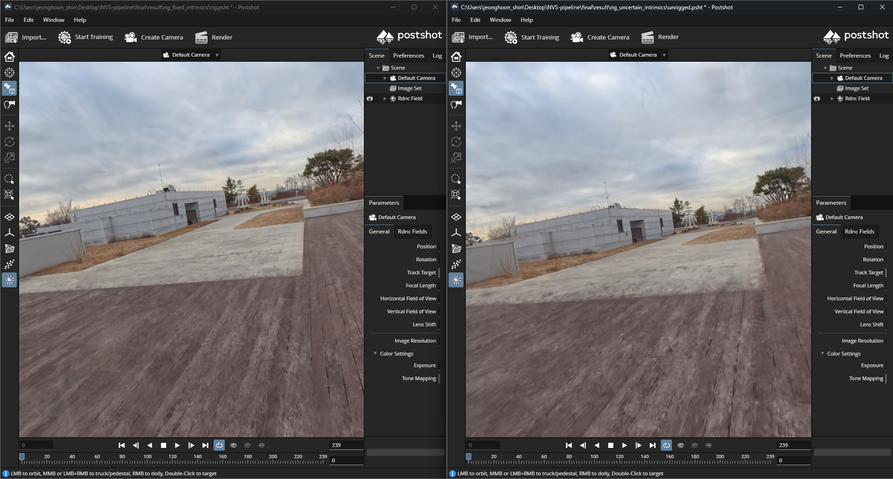

# Experiment: Manual Camera Intrinsics in COLMAP

<p align="center">
  <!--  -->
  <br>
  <em>Figure 0: Overview of the manual intrinsic calibration experiment (Placeholder).</em>
</p>

## Abstract
*   **Objective:** Evaluate the impact of manually defining camera intrinsics versus COLMAP's automatic deduction.
*   **Hypothesis:** Explicit parameterization of the camera model (Pinhole) improves reconstruction accuracy and processing speed for synthetic/fixed views.
*   **Process:**
    *   Theoretical calculation of intrinsic parameters.
    *   Manual enforcement via COLMAP CLI/GUI.
    *   Comparative analysis of sparse reconstruction.
*   **Key Finding:** Manually enforcing a `PINHOLE` model and a zero-translation rig configuration significantly improves reconstruction stability, resulting in a 3x increase in sparse point density and visibly sharper textures in the final Gaussian Splatting output.

## Motivation
*   **Source:** [Reports](https://github.com/kyowon1108/gsplat-onthefly-nvs-study) suggesting that manual intrinsic specification can significantly enhance the quality of the final rendered Gaussian Splatting scene.
*   **Goal:** Test the hypothesis that providing ground-truth or manually calculated parameters leads to a superior reconstruction compared to COLMAP's automatic estimation.

## Introduction
*   **Purpose:** Document the procedure and results of overriding COLMAP's auto-calibration.
*   **Scope:** Focuses specifically on the "Feature Extraction" and "Matching" phases where intrinsics are critical.
*   **Context:**
    *   This experiment is a direct follow-up to the "Future Work" hypothesis in the overall workflow documentation.
    *   Input images are generated via Blender (virtual camera), meaning "perfect" ground truth intrinsics are theoretically available.

## System Specifications
| Component | Specification |
| :---------- | :------------------------------------------- |
| OS | Windows 11 |
| CPU | 13th Gen Intel(R) Core(TM) i7-13620H @ 2.40 GHz |
| RAM | 32.0 GB |
| GPU | NVIDIA GeForce RTX 4060 Laptop GPU |
| VRAM | 8.0 GB (Dedicated) |

## Methodology: Intrinsic Calculation
*   **Source:** Blender 360 Extractor settings.
*   **Camera Model:** `PINHOLE`
    *   This model was chosen because the input consists of "perfect" virtual renders rather than physical lens captures.
*   **Parameters:**
    *   **Resolution:** $1920 \times 1920$
    *   **Focal Length ($f_x, f_y$):** $960$ (calculated as half of the image resolution, corresponding to a 90° FOV).
    *   **Principal Point ($c_x, c_y$):** $960, 960$ (geometric center of the image).

## Methodology: COLMAP Configuration
*   **Software:** COLMAP 3.13.0 (CUDA enabled).
*   **Environment:** PowerShell (Windows 11).
*   **Environment Variables:**
    The following placeholders are used in the commands below to represent local file paths:
    *   `${DATABASE_PATH}`: Path to the SQLite database (e.g., `database.db`)
    *   `${IMAGE_PATH}`: Root directory of the input images (e.g., `images_by_camera/`)
    *   `${RIG_CONFIG_PATH}`: Path to the JSON rig configuration (e.g., `rig_config.json`)
    *   `${OUTPUT_PATH}`: Directory for the sparse reconstruction output (e.g., `sparse/`)

*   **Tooling Choice:** 
    *   **CLI Enforcement:** Since the COLMAP GUI does not support the explicit configuration of camera rigs and their associated intrinsic parameters, the **Command Line Interface (CLI)** was utilized for the extraction and matching phases.

*   **Feature Extraction Process:**
    *   **Command (PowerShell):**
        ```powershell
        colmap feature_extractor \
          --database_path ${DATABASE_PATH} \
          --image_path ${IMAGE_PATH} \
          --ImageReader.single_camera_per_folder 1 \
          --ImageReader.camera_model PINHOLE \
          --ImageReader.camera_params "960,960,960,960" \
          --FeatureExtraction.use_gpu 1
        ```
    *   **Key Parameter Logic:**
        *   `--ImageReader.single_camera_per_folder 1`: Ensures that images categorized into folders (the 5 virtual cameras) are treated as distinct camera sensors.
        *   `--ImageReader.camera_model PINHOLE`: Forces the simple pinhole model appropriate for virtual renders.
        *   `--ImageReader.camera_params "960,960,960,960"`: Explicitly sets $f_x, f_y, c_x, c_y$ to the pre-calculated ground truth values.
        *   `--FeatureExtraction.use_gpu 1`: Leverages the RTX 4060 for performance.

*   **Rig Configuration Process:**
    *   **Command (PowerShell):**
        ```powershell
        colmap rig_configurator \
          --database_path ${DATABASE_PATH} \
          --rig_config_path ${RIG_CONFIG_PATH}
        ```
    *   **Implementation Detail:**
        *   The Blender 360 Extractor addon can export a camera group template (e.g., `camera_groups_20XX-XX-XX.json`).
        *   **CRITICAL:** When converting this template to COLMAP's `rig_config.json` format, the translation vector for every camera must be manually overridden to:
          `"cam_from_rig_translation": [0.0, 0.0, 0.0]`
        *   This ensures COLMAP treats the rig as a single nodal point, matching the physical reality of the equirectangular source.
    *   **Purpose:** Explicitly defines the spatial relationship between the 5 virtual cameras. Since the "rig" (the Blender extraction setup) is fixed for every frame, this ensures COLMAP respects the constant relative pose between sensors, significantly constraining the search space for camera estimation.

    *   **Caveats: The 360° Rig Paradigm**
        *   **The Zero-Translation Reality:**
            *   Since the input footage originates from a single 360° camera (equirectangular video), all extracted pinhole views effectively share the exact same optical center.
            *   **The Addon Default Problem:** By default, the Blender 360 Extractor addon generates a camera group arranged in a ring (see `Screenshot 2026-01-16 053016.png`). This layout includes spatial translation between cameras.
            *   **Why it Fails:** Using the default ring layout for 360° video introduces "fake" parallax. COLMAP will attempt to solve for translations that do not exist in the source equirectangular projection, leading to reconstruction errors or failure to converge.
            *   **The Solution:** The cameras must be manually or programmatically moved to a **coincident position** ($T = [0, 0, 0]$). In this setup, the rig is defined purely by the **Rotational** differences required to sample different quadrants of the sphere (see the corrected layout in `Screenshot 2026-01-16 052947.png`).
            *   **Implication for COLMAP:** In the `rig_config.json`, the translation parameters between the cameras should always be set to zero.

        *   **JSON Configuration Comparison:**
            To successfully implement this rig in COLMAP, the non-zero locations from the Blender export must be suppressed.

            1. **Blender Addon Export (Original)**
            The `location` values reflect the addon's default ring/cube visualization, which introduces artificial parallax.
            ```json
            {
                "name": "High_Cam01",
                "location": [0.7071, 0.7071, 1.0], 
                "rotation": [0.5624, 0.7329, -0.3036, -0.2329]
            }
            ```

            2. **COLMAP Rig Config (Required)**
            The `cam_from_rig_translation` is explicitly zeroed to enforce the shared nodal point paradigm.
            ```json
            {
                "image_prefix": "High_Cam02/",
                "cam_from_rig_rotation": [...],
                "cam_from_rig_translation": [0.0, 0.0, 0.0] 
            }
            ```

        *   **Coordinate System Conversion:**
            When programmatically generating the `rig_config.json` from Blender data, note that Blender and COLMAP/OpenCV use different coordinate systems.

            *   **Transformation Matrix (Blender to COLMAP):**
                *   Blender uses a Right-Handed system (+Z Up, +Y Forward).
                *   COLMAP/OpenCV uses a Right-Handed system (+Y Down, +Z Forward).
                *   **Conversion:** `T = np.diag([1, -1, -1])` which flips the Y and Z axes.
                *   **Rotation Application:** `R_colmap = T @ R_blender @ T`

            *   **Relative Rotation Calculation:**
                *   The rig configuration requires the relative rotation of each camera *with respect to* a reference camera (often the first camera in the rig).
                *   **Formula:** `cam_from_ref = R_cam.T @ R_ref`
                *   where `R_cam` is the rotation matrix of the current camera and `R_ref` is the rotation matrix of the reference camera (both in the COLMAP coordinate frame).

*   **Sequential Matching Process:**
    *   **Command (PowerShell):**
        ```powershell
        colmap sequential_matcher \
          --database_path ${DATABASE_PATH} \
          --FeatureMatching.rig_verification 1 \
          --SequentialMatching.overlap 10 \
          --SequentialMatching.quadratic_overlap 1 \
          --FeatureMatching.use_gpu 1
        ```
    *   **Key Parameter Logic:**
        *   `--FeatureMatching.rig_verification 1`: Forces COLMAP to verify matches against the defined rig geometry, filtering out spurious matches that violate the fixed relative poses.
        *   `--SequentialMatching.overlap 10`: Searches for matches within a window of 10 neighboring frames.
        *   `--SequentialMatching.quadratic_overlap 1`: Enables quadratic overlap search for more robust matching over longer sequences.

*   **Mapping (Sparse Reconstruction) Process:**
    *   **Command (PowerShell):**
        ```powershell
        colmap mapper \
          --database_path ${DATABASE_PATH} \
          --image_path ${IMAGE_PATH} \
          --output_path ${OUTPUT_PATH} \
          --Mapper.ba_refine_sensor_from_rig 0 \
          --Mapper.ba_refine_focal_length 0 \
          --Mapper.ba_refine_principal_point 0 \
          --Mapper.ba_refine_extra_params 0
        ```
    *   **Key Parameter Logic (Freeze Ground Truth):**
        *   `--Mapper.ba_refine_sensor_from_rig 0`: Prevents COLMAP from adjusting the relative pose of cameras within the rig during Bundle Adjustment.
        *   `--Mapper.ba_refine_focal_length 0`: Locks the pre-calculated focal length.
        *   `--Mapper.ba_refine_principal_point 0`: Locks the principal point at the geometric center.
        *   `--Mapper.ba_refine_extra_params 0`: Prevents refinement of any additional distortion parameters (not needed for the `PINHOLE` model).
        *   **Goal:** By "freezing" these parameters, we force COLMAP to solve only for the global trajectory (rotation/translation) of the rig, preserving the mathematical perfection of the synthetic source.

*   **Approach:**
    *   **Control Group:** Default automatic deduction (`SIMPLE_RADIAL` or similar via GUI).
    *   **Experimental Group:** Manually enforced `PINHOLE` model via CLI with the fixed parameters above.

## Results and Discussion
*   **Observation:** 
    *   **Success (Rig Constrained):** When the `rig_config.json` was correctly applied with zero translation, COLMAP produced a "star" pattern where all frustums for a single pose share a common origin (see `Screenshot 2026-01-16 022730.png`).
    *   **Failure (Default/Unconstrained):** Without the rig constraint or with incorrect translations, COLMAP treats each camera as an independent entity. This results in a scattered, disorganized reconstruction with lower point density (see `Screenshot 2026-01-16 054304.png`).
*   **Performance:**
    *   **Rig Constrained:** 40 Frames (360 Images) yielded ~60,000 points. The shared nodal point constraint significantly reduced the degrees of freedom, leading to a more stable and dense sparse cloud.
    *   **Unconstrained:** 317 Frames (317 Images) yielded only ~22,000 points. The lack of geometric constraints made it harder for COLMAP to find a consistent global solution for the virtual 360° setup.

### Qualitative Comparison: Manual Rig vs. Automatic Deduction
<p align="center">
  
  <br>
  <em>Figure 1: Side-by-side comparison of the final Gaussian Splatting render. <b>Left:</b> Result using the manual rig configuration with fixed intrinsics. Note the sharp textures on the deck and crisp building edges. <b>Right:</b> Result using unconstrained automatic deduction. Note the overall softness, muddy textures, and loss of structural definition.</em>
</p>

<p align="center">
   
  <br>
  <em>Figure 2: Close-up texture comparison. <b>Left (Unrigged/F.png):</b> The wall and floor textures are washed out with "cloudy" artifacts. <b>Right (Rigged/H.png):</b> The same surface shows distinct, sharp weathering details.</em>
  <br><br>
   
  <br>
  <em>Figure 3: Wide-angle structural comparison. <b>Left (Unrigged/G.png):</b> Distant objects like the bench and pot lack definition. <b>Right (Rigged/I.png):</b> The geometry remains stable and sharp even at a distance.</em>
</p>

## Conclusion
*   **Verdict:** Manually enforcing camera intrinsics (`PINHOLE`) and a zero-translation rig configuration is **essential** when working with 360° equirectangular sources.
*   **Recommendation:** Always override the default Blender addon's `location` values to `[0,0,0]` in the COLMAP `rig_config.json`. This transforms the problem from solving hundreds of independent camera poses to solving a much smaller number of rig poses, dramatically improving reconstruction quality and reliability for Gaussian Splatting.

## Future Work: Quantitative Analysis
To rigorously validate the qualitative improvements observed, future experiments will quantify the difference between the two methods using the following metrics:

### Image Quality Metrics (Novel View Synthesis)
Rendered views from the Gaussian Splatting model will be compared against held-out ground truth frames from Blender.
*   **PSNR (Peak Signal-to-Noise Ratio):** Measures the pixel-level fidelity of the reconstruction. *Target: Higher is better.*
*   **SSIM (Structural Similarity Index Measure):** Evaluates the perceived structural similarity, accounting for luminance and contrast. *Target: Closer to 1 is better.*
*   **LPIPS (Learned Perceptual Image Patch Similarity):** Assesses perceptual distance using deep network features, correlating better with human judgment than PSNR. *Target: Closer to 0 is better.*

### Geometric Accuracy (Structure-from-Motion)
Since the dataset is synthetic, perfect ground truth camera poses are available.
*   **ATE (Absolute Trajectory Error):** Calculates the Root Mean Square Error (RMSE) between the estimated camera trajectory and the ground truth Blender path (after alignment). This directly measures if the "Rigged" approach eliminates the phantom translation drift.
*   **Reprojection Error:** A standard COLMAP metric measuring the distance (in pixels) between projected 3D points and their observed 2D feature locations. *Target: Lower is better (typically < 1px).*

## References
*   [COLMAP Camera Models](https://colmap.github.io/cameras.html)
*   [GSplat On-the-fly NVS Study](https://github.com/kyowon1108/gsplat-onthefly-nvs-study)